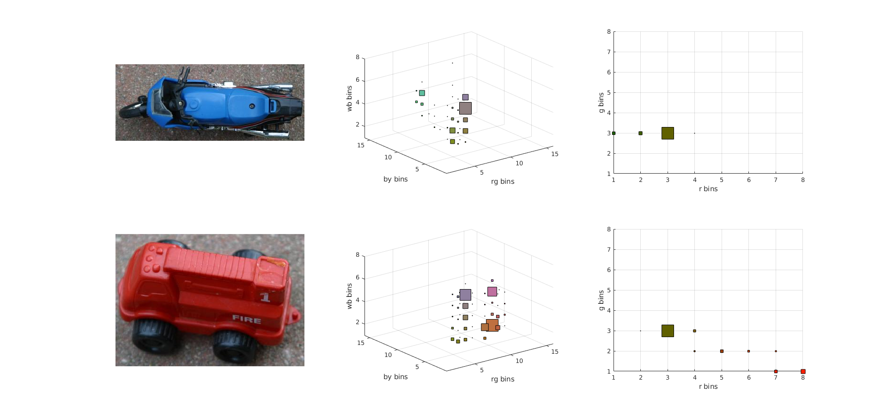
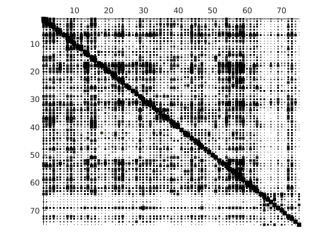

# Histogram Backprojection

MATLAB implementation of 3D Histogram and Histogram Backprojection.

### 2D and 3D RGB Histograms

### Histogram Intersection Matrix

### Histogram Backprojection

# References

Compute and plot 3D histogram: [3D Histogram](https://www.mathworks.com/matlabcentral/fileexchange/52686-representation-of-the-3d-joint-rgb-histogram)

Algorithm for Histogram Backprojection: [Histogram Backprojection](https://docs.opencv.org/master/dc/df6/tutorial_py_histogram_backprojection.html)
